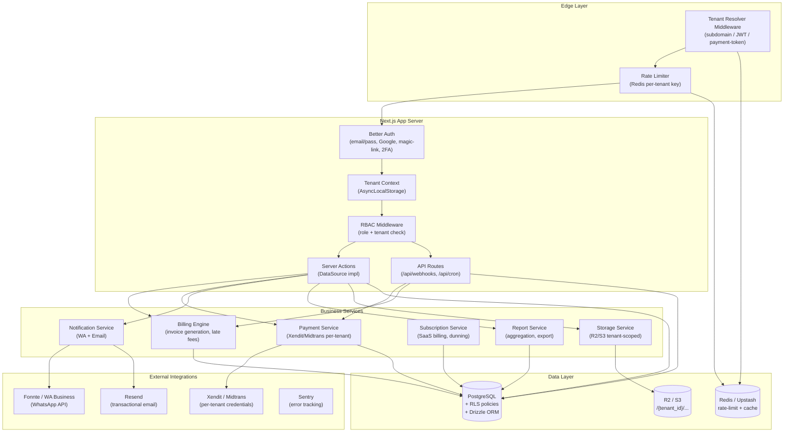
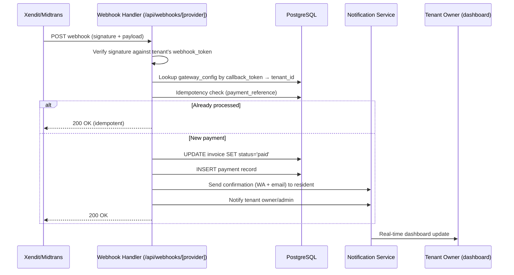

# KosKita

SaaS multi-tenant untuk manajemen kos (boarding house) di Indonesia. Dibangun sebagai **monolith modular** di atas Next.js 16 App Router — satu codebase untuk frontend, backend, dan API.

## Architecture Overview

KosKita menggunakan arsitektur **multi-tenant monolith** dengan isolasi data via PostgreSQL Row-Level Security (RLS). Setiap request melewati Tenant Resolver Middleware yang menentukan `tenant_id` dari JWT session, subdomain, atau payment token. Context disimpan di AsyncLocalStorage dan dipropagasi ke seluruh service layer.



## Payment Webhook Flow

Alur pemrosesan webhook pembayaran — dari gateway hingga update status invoice:



## Tech Stack

| Layer | Technology |
|-------|-----------|
| Framework | Next.js 16 (App Router) + TypeScript |
| Styling | Tailwind CSS + shadcn/ui (custom skin) |
| Database | PostgreSQL 16 + Drizzle ORM + RLS |
| Cache/Rate Limit | Redis (Upstash in prod, local in dev) |
| Auth | Better Auth (email/pass, Google, magic-link, 2FA) |
| Payments | Xendit / Midtrans (per-tenant credentials) |
| Notifications | Fonnte (WhatsApp) + Resend (email) |
| Storage | Cloudflare R2 / S3 |
| Testing | Vitest + fast-check + Playwright |
| Lint/Format | Biome |
| Error Tracking | Sentry |

## Getting Started

### Prerequisites

- Node.js 20+
- Docker & Docker Compose
- npm

### Setup

```bash
# 1. Start local services (PostgreSQL + Redis)
docker compose up -d

# 2. Install dependencies
npm install

# 3. Copy environment variables
cp .env.example .env

# 4. Run database migrations
npm run db:migrate

# 5. Seed development data
npm run db:seed

# 6. Start development server
npm run dev
```

The app will be available at [http://localhost:3000](http://localhost:3000).

### Stopping Services

```bash
docker compose down        # stop containers (data persists in volumes)
docker compose down -v     # stop and remove volumes (fresh start)
```

## Available Scripts

| Script | Description |
|--------|-------------|
| `npm run dev` | Start Next.js dev server |
| `npm run build` | Production build |
| `npm start` | Start production server |
| `npm run lint` | Run Biome linter |
| `npm run lint:fix` | Auto-fix lint issues |
| `npm run format` | Format code with Biome |
| `npm test` | Run unit & property tests (Vitest) |
| `npm run test:watch` | Run tests in watch mode |
| `npm run test:e2e` | Run E2E tests (Playwright) |
| `npm run db:generate` | Generate Drizzle migration |
| `npm run db:migrate` | Run pending migrations |
| `npm run db:push` | Push schema to DB (dev only) |
| `npm run db:seed` | Seed database with test data |

## Project Structure

```
src/
├── app/                    # Next.js App Router
│   ├── (marketing)/        # Landing page
│   ├── (auth)/             # Login, register
│   ├── (onboarding)/       # Onboarding wizard
│   ├── (dashboard)/        # Main tenant dashboard
│   ├── (public-pay)/       # Public payment pages
│   ├── (super-admin)/      # Platform admin
│   └── api/                # API routes (webhooks, cron)
├── components/             # UI components (shadcn re-skin)
├── lib/
│   ├── data/               # DataSource interface + swap
│   ├── mock/               # Mock DataSource (Phase 1)
│   ├── server/             # Backend services
│   │   ├── auth/           # Better Auth + RBAC
│   │   ├── billing/        # Billing engine
│   │   ├── db/             # Drizzle schema + migrations
│   │   ├── notifications/  # WA + email providers
│   │   ├── payments/       # Gateway integration
│   │   ├── subscriptions/  # SaaS billing
│   │   ├── storage/        # R2/S3 file management
│   │   ├── tenant/         # Context + middleware
│   │   ├── admin/          # Super admin service
│   │   ├── audit/          # Audit logging
│   │   └── ratelimit/      # Rate limiting
│   ├── locale/             # i18n, Rupiah formatting
│   └── schemas/            # Zod validation schemas
└── styles/                 # Global CSS (OKLCH tokens)
```

## Environment Variables

See [`.env.example`](.env.example) for all required variables. Key ones for local development:

- `DATABASE_URL` — PostgreSQL connection (Docker default works out of the box)
- `REDIS_URL` — Redis connection (Docker default works out of the box)
- `USE_REAL_DB` — Set to `true` to use real PostgreSQL; `false` for mock data

## Visual Identity

Palet hangat botani (pandan hijau + kunyit + terracotta), tipografi Bricolage Grotesque / Plus Jakarta Sans / JetBrains Mono, dan motif anyaman halus. Sengaja menghindari tampilan "SaaS generik".

## License

Private — All rights reserved.
